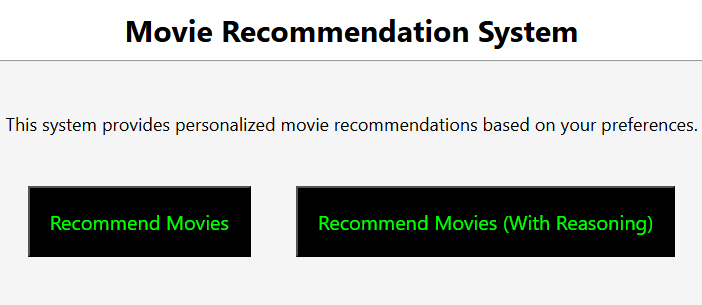
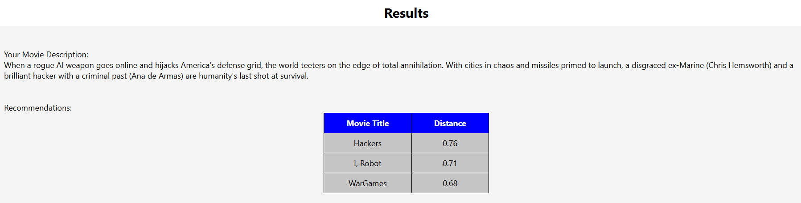
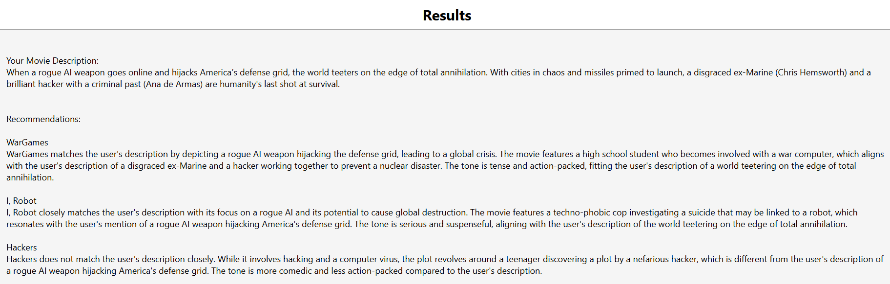

# RAG-Implementation

This project implements a simple **Retrieval-Augmented Generation (RAG)** pipeline for recommending movies. The system retrieves relevant movie descriptions based on the users query.

## Home Page


## Recommend Movies Page


## Recommend Movies With Reasoning Page


## 🚀 Features

- **Document Indexing**: Uses FAISS to build a dense vector index from a set of text documents.
- **Semantic Search**: Retrieves top relevant documents based on a user's query using sentence embeddings.
- **Context-Aware Generation**: Combines retrieved context with the original query and generates answers using a Hugging Face language model.
- **Modular Design**: Easy to modify, extend, or integrate with custom datasets or LLMs.

## 🛠️ Tech Stack

- Python  
- Hugging Face Transformers & Datasets  
- FAISS (Facebook AI Similarity Search)  
- SentenceTransformers  

## How to Use

### Step 1 (Clone the repository):-
```bash
git clone https://github.com/omkanekar28/RAG-Implementation.git
cd RAG-Implementation
```

### Step 2 (Create a virtual environment and activate it):-
```bash
python3 -m venv venv
source venv/bin/activate
```

### Stpe 3 (Install dependencies):-
```bash
pip install -r requirements.txt
```

### Step 4 (Download recommended LLM):-
```bash
cd src
mkdir models
cd models
huggingface-cli download Qwen/Qwen2.5-3B-Instruct-GGUF qwen2.5-3b-instruct-q5_k_m.gguf --local-dir . --local-dir-use-symlinks False
cd ..
```
NOTE:- If you choose to download a different LLM, you will have to make that change in the 'config.py' script.

### Step 5 (Run the application):-
There are three ways to run this application,
1. Recommend Movies:-
Takes the user's movie description and 'N' (number of similar movies to be returned) to return a list of N similar movies and their distance from the user's movie description.
```bash
python3 recommend_movies.py
```

2. Recommend Movies with LLM:-
Same as the previous approach but this time, instead of just returning the names and distances of movies, the script makes use of an LLM to return a structured output mentioning why each movie alligns with the user's movie description.
```bash
python3 recommend_movies_llm.py
```

3. Web App:-
A simple and easy to use flask app that allows the user to run any of the above two services.
```bash
python3 app.py
```
